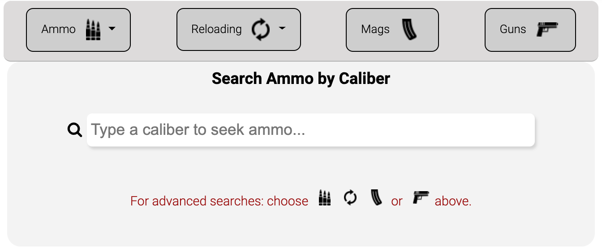
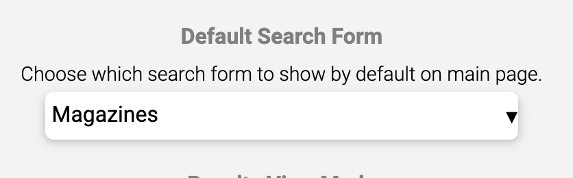

Once we opened up our new site to the world, we began receiving some excellent suggestions. One of them, was to put the user sign-in/sign-up button and menu on the top right of the page to make it like other sites. We wanted to do it; however, that location was being occupied by our "Search Ammo by Caliber" search box. After some discussion, we decided... Hey, why not make that the default search form. So we did.

Now, by default, rather than being sent to the Handgun search form, we show the "Search Ammo by Caliber" search box. But, we weren't done. We decided to allow logged-in users set whichever search form they want to display by default. Now, any registered user can decide which form they want to see by default, whether it be Handgun, Rifle, Magazines, and so on.

Here's a screenshot of the default "By Caliber" search form:

It is an auto-complete search, so it will suggest calibers as you type. Once your desired caliber is highlighted, hitting enter will execute a search for that caliber. This greatly simplifies the default search for new AmmoSeek visitors.

For the expert AmmoSeek folks, we offer the more advanced and specific search forms by selecting from the buttons above the default form. Also, for registered users, you can now set your preferred default search form in Account Settings. It is located a bit towards the bottom of the settings window. Here's what that looks like when 'Magazines' is selected as the default search form:

We have more improvements on the way! We hope you continue finding AmmoSeek useful for all of your guns, ammo, reloading, and magazine purchasing needs!
