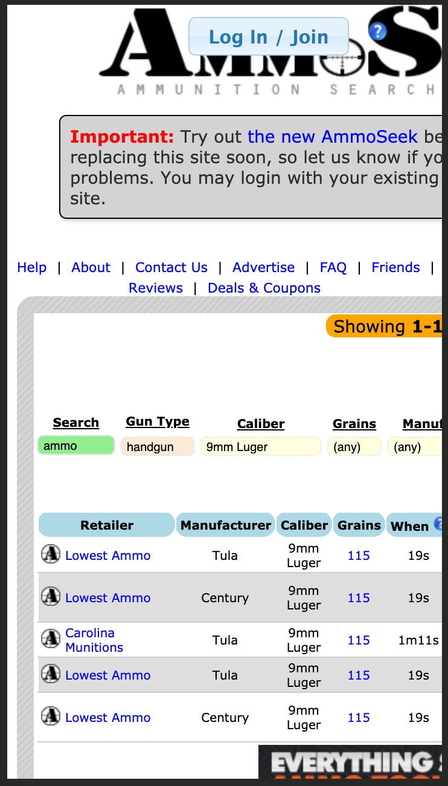

Change is good, especially when you have flat or bald tires. The [classic AmmoSeek (still available here)](https://classic.ammoseek.com) lost the air in, and the tread on, its tires over the 10 years of its existence.

**[The new AmmoSeek.com](https://ammoseek.com/)** is in place and some folks are unhappy with the change. During our open beta period, we had a survey that was open for a couple months as folks tried out the new site. Out of the people that tried the new site while it was in beta, 86.5% rated it at 7 or above (on a 1 to 10 scale). There were over 2000 respondents to the survey. But not everyone is pleased with the new site now that it is out of beta.

Some of this is to be expected since being resistent to change is just human nature; however, we want to make sure it is clear why a change was necessary and our planned improvements going forward.

### Why change?

Here are the main reasons. The old (classic) AmmoSeek...

1. was not "mobile-friendly"
2. had an outdated general design/style
3. was using old, insecure third-party code libraries

We'll go through that list in detail below. Then, we'll present some new site features. Finally, we'll discuss our planned improvements moving forward. In other words, this is the **State of AmmoSeek in 2020**.

The [classic AmmoSeek](https://classic.ammoseek.com/) was not a mobile-friendly web site. For example, here is what the search results looked like on AmmoSeek.com prior to the February 2020 update:

Aside from the horrible look of the "Log In / Join" button hovering above the logo, it **requires significant horizontal scrolling... left... right, and back again** to do **anything**. This is a very bad user experience and because of this, the site gets penalized by search engine results like Google, Bing, etc..

Another reason this is a bad user experience is that the clickable form elements, fonts, and links are extremely small. Besides being annoying for people, search engines don't like it either. In order to click on things, without accidentally clicking on something unintended, required a pinch-zoom/unzoom to make the elements larger for a human being's finger tip.

The old site was never designed with mobile devices in mind. Sure, it could be made to "work", but it would never be considered "mobile-friendly" for the reasons above. So, it was long overdue to move towards a site design that considered these short-comings and attempted to eliminate them.

For comparison, have a look at the same results page on the new site:

This is an improvement! No overlapping login button. No horizontal scrolling. No zoom required to click on things. You can see all the information about each results record. It also has a more modern design.

The original AmmoSeek design occurred in 2009. At that time, the web was a very different place than it is today. That design never changed (in any significant way), until now, 11 years later. That design made heavy use of HTML tables for layout. Aside from being difficult on the developer, it is widely considered a bad practice (especially these days).

Tables were created to show data, sort of like a spreadsheet, but for a web page. We do make use of tables for the results on non-mobile desktop browsers on the new site. However, we are no longer using tables for laying out the entire web page like we did for the classic site. There are other style and design decisions that made us due for a change, but using tables for layout was a major one.

Finally, AmmoSeek needed to start using more up-to-date third party utilities and libraries. We still aren't "cutting edge" in this area on the new site, but we are getting there. The old libraries we made use of have known security problems that we had to work around. By using more modern libraries, there are less work-arounds required. Also, in many cases, the same code will execute more faster and efficiently. Faster code, faster user experience on the site. That is an ongoing goal for us as we work on improving the new site even more.

### New Features

We've made a few posts discussing some of the new features we've implemented on the new site that does not exist on the old. Here they are:

- [New Default: Search By Caliber](/posts/default-search-by-caliber) - The default search form is simpler, allowing you to type in *any* caliber, regardless of type, and quickly get results for the chosen caliber.
- [Compact Results Mode](/posts/ammoseek-feature-compact-results) - On desktop browsers, toggle the results so they are less sparsely spaced, similar to the classic site format.
- [Custom Color Themes](/posts/ammoseek-feature-color-themes) - Choose a new color theme for your preferred look/feel. We're taking requests for implementing additional color schemes here.

In addition to the above, we haven't yet created articles about the following new features:

- **Searching by a range of grains** is now available for types that have 'gains' as a valid attribute (non-shotgun ammo and bullet).
- **Filtering caliber & mfg with auto-completion** in the search form selections, to quickly find your choice in the long long list of options.
- Additional account setting customizations, such as **being able to choose and save your preferences** for compact results mode, default search form type, color themes, and more. Open your Account Settings from your user menu in the upper right part of the browser window. If you're logged in, it will display your name. If not, it will display "Sign In / Sign Up". As you might expect, updating your account settings requires a free registered account.

###Coming Soon

Please stay tuned as we have plans to continue adding new features and improving the site going forward. In fact here are a few things we are planning based on the feedback we received thus far:

1. **A new modify search form for desktop browsers** that is more like the classic site - putting it right at the top of the results page instead of having it "hiding" as a side-menu popout.
2. **A new modify search experience for mobile** - improving the current behavior of the modify search side-menu on mobile devices both in form and function.
3. **A new main page design for mobile** - getting rid of the extraneous, less-utilized elements and making the search forms and options closer to the top of mobile screen.
4. **Make "By Caliber" search available on results pages** - Right now this is only available on the main search page.
5. **Work on limiting the 'loading form' occurrences** - This is mainly referring to the modify results form in the side-menu. Look at loading all the forms at once and switching between them without having to load each one again.
6. **Speed optimizations** - extensively going through the codebase and improving logic, methodologies, etc. to improve the performance of the entire site/app.

Thank you for using AmmoSeek! We sincerely hope you continue to do so. Please don't hesitate to [provide us feedback](https://ammoseek.com/contact) on the new site's problems, styles, behavior, and planned features. Feel free to throw in some positive feedback every once in awhile too, if you wish. It keeps us fueled to continue working hard every single day at fixing our old tires, and helping everyone get used to the feel of the new ones.
