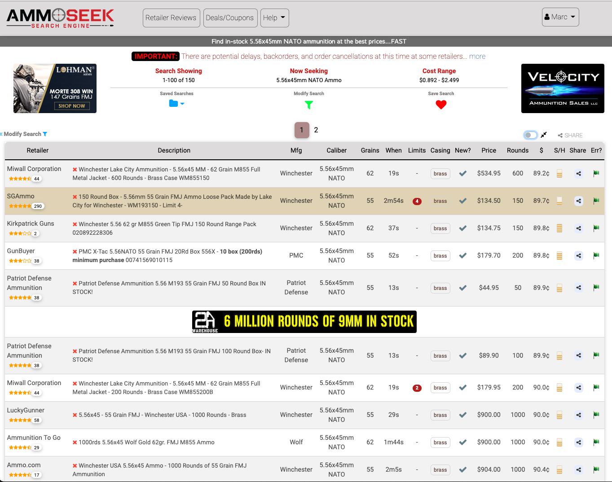
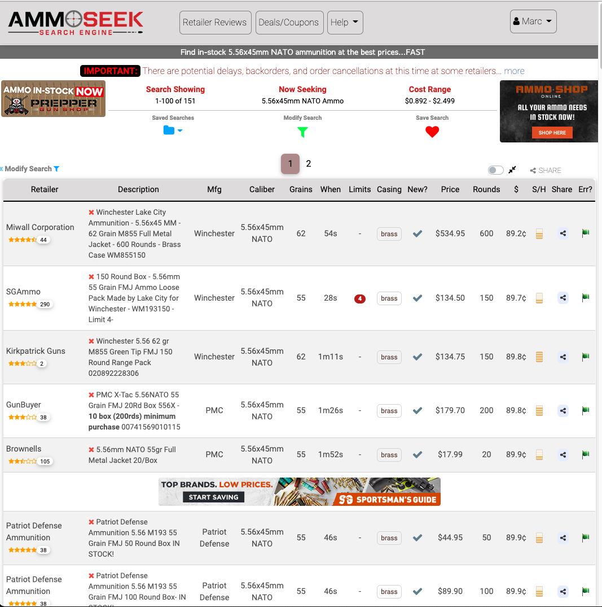

Today we have a new AmmoSeek major release to announce. This update includes major changes in style, functionality, and behavior. We've done our best with testing things, but there will likely be some bugs. If you discover any, please [report them](https://ammoseek.com/contact).

With that out of the way, let's go through all the changes.

## Mobile Improvements

Since the initial release of our updated site over a year ago we've received a lot of feedback, both negative and positive. One of the chief complaints was that the site was still not simple to use on mobile browsers. This was the main driving force behind this update.

Another driving force was to move away from our outdated native mobile app. We were forced into this decision thanks to companies like Google choosing to remove/ban the app from their app store. For now the outdated app remains available on the Apple Store, but that could change at any time. We want to sever our dependence on such companies going forward. We'll provide more information on this in a later article.

### What has been improved on mobile browsers?

1. The "Search Ammo By Caliber search box" is front and center now.
2. Navigating the various search types/categories has been moved to bottom buttons/menus on both the main page and results page. Different options are shown based on your actions.
3. Modifying a search slides up a window from the bottom of the screen allowing for filtering/adjusting your search parameters, or switching to another search category.
4. The QuickSeek card is no longer displayed on mobile. We may bring this back and place it below the main search form in the future.
5. Saved Searches (for registered accounts that have them) are now located at the right/top of the page.

### New vs. Original Comparison - Main Page on Mobile (Not Signed In)

### New vs Original - Results Page on Mobile (Not Signed In)

As you can see all (or at least the most used) navigation functions have been moved to the bottom of the screen, within "thumb reach". Here are a few more screenshots of the new features.

### New Results Page with Modify Search Open

### New Results Page (Signed In)

That covers the major changes for mobile browsers. Let's take a look at the changes for the desktop.

## Desktop/Larger Tablets Improvements

For desktop browsers the main page remains largely unchanged, other than a few minor style improvements, and advanced search parameter updates. The big changes on desktop are mostly on the results pages.

First, depending upon the width of the browser window you will either see the modify search options on the left or it will require clicking the toggle button to open/close it. These modify search options no longer obscure the results. Instead it pushes/expands/reformats the results as required to be seen at all times.

At certain widths the results will be presented in table (spreadsheet) form and at others the results will be displayed in multi-line sections similar to the way the results appear on mobile devices. It also will adjust accordingly and differently if you are in "compact results mode" or not.

Here are some screenshots of various views of the new results pages.

### Wide Browser Results (Compact mode off)

### Wide Browser Results (Compact mode on)

### Wide Browser Results / Search Closed (Compact mode off)

### Medium Width Desktop Results

### Medium Width Desktop Results / Search Open

I think you get the point by now. We hope you find the changes as a good step toward making AmmoSeek simpler to use and a bit less cumbersome (especially on mobile).

Please reach out to us if you notice any bugs or poor behavior with this update. As mentioned above there will likely be some bugs and we'd like to get them fixed!

To report bugs [contact us here](https://ammoseek.com/contact).

Happy AmmoSeeking!
