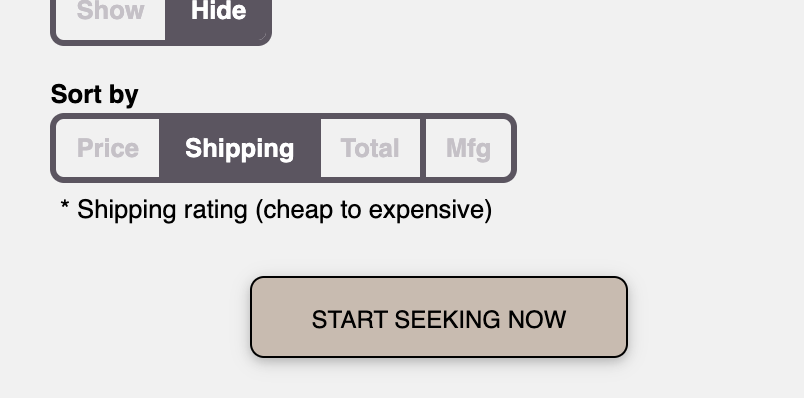

We've been hard at work incorporating the AmmoSeek shipping rating into search results in a more effective way. We are pleased to announce that you can choose to sort your results by the shipping rating!

### How?
On the advanced search forms for ammo (handgun, rifle, rimfire, shotgun) towards the bottom there is a new option in the sort by selections called "shipping". Choosing this option will sort and group the results from cheapest to most expensive shipping, and then sort within each group by cost-per-round.

[Give it a try](https://ammoseek.com/) and [let us know](https://ammoseek.com/contact/) what you think!

### Why?
Since it is not currently feasible for AmmoSeek to include actual shipping costs in our cost-per-round calculations we created a shipping score and rating algorithm. The ratings are updated over time and are meant to give you a general idea of the relative shipping and handling costs for a given retailer. It's not a perfect system but should provide a good ballpark idea about which retailers have relatively high/low shipping costs. Each rating is done on a per retailer basis (unless a specific product has free or conditionally free shipping).

Also, we (currently) only show the rating on ammunition products, but we may add the rating display to non-ammo product results in the future.

For a more details on the shipping algorithm, see [NEW: Major Shipping Score (Rating) Update](/posts/shipping-score).

Enjoy!
