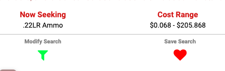
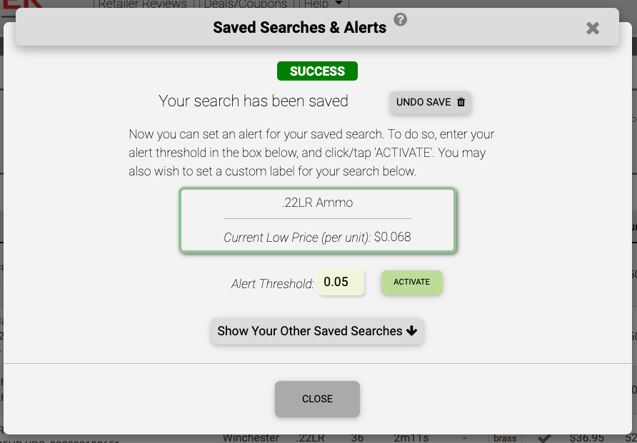
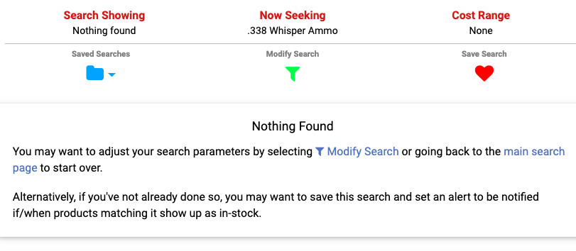
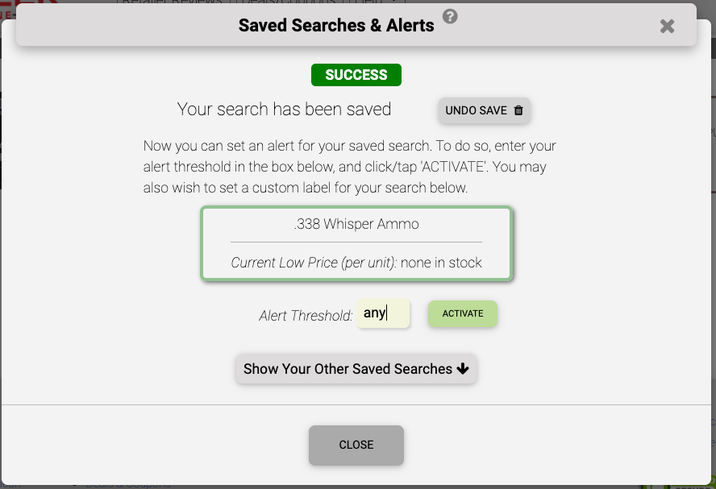

During this period of [unprecedented demand for ammunition](/posts/ammo-delays-backorders) we deemed it important to provide some detailed instructions for one of AmmoSeek's most useful features: price alerts.

### What are price alerts?

Price alerts allow you to be notified via email and/or text message when product(s) become available at your preferred price point. Alerts can also be utilized to be notified when your preferred product(s) becomes available for purchase at any price point. This secondary use is especially relevant during times of high demand and low supply, which the industry is experiencing right now.

### Requirements

There are two requirements for utilizing AmmoSeek price alerts.

First, you must have a free registered AmmoSeek account. If you don't already have an account, you can [sign up here](https://ammoseek.com/signin). We use this account information to alert you via your email address, and optionally, your mobile number via text/SMS message when your price point is met/beat.

Lastly, you must have a "saved search" that shows the products for which you wish to be alerted. AmmoSeek will periodically scan your saved searches for your chosen price threshold and send you a notification should the results of your saved search meet or beat it.

Note that you can set your price threshold to 'any' in order to be notified if an item becomes available at 'any' price. This can/should be set on saved searches that return no results. You are then notified if what you are looking for arrives in-stock at 'any' price. This is the method to use for checking the in-stock/availability of product(s) which again, is extremely useful/relevant right now.

### About Notifications

There are two methods we offer to notify you when your threshold is met/beat. The first is via email. This is a required method and cannot be disabled. The other method is via text (SMS) message. This is completely optional and is the only reason we ask for your mobile number during registration. If you do not wish to be alerted via text message then there is no need to provide us with your phone number during registration. You can remove or update your number under the 'Account Settings' menu at any time.

One final important thing to know about notifications: Once an alert is triggered and you are sent a notification your alert is deactivated automatically and must be manually re-enabled. This is to prevent us from spamming you with notifications.

### Walk-Through Examples

First, be sure you are logged in to AmmoSeek. Once logged in, perform a search for a product or set of products you wish to buy.

### Example 1: In-stock product, notify me at my price

In this case, we'll do a search for all 22LR Rimfire ammunition. Once on the results page we click the red heart above the results to "Save Search".

That action will bring up a window where you can immediately set an alert for the saved search. The window shows the current lowest price for the search for reference. Your chose price threshold must be below this price.

Here we enter '0.05' (or 5 cents). Then we click the 'ACTIVATE' button. We will now be notified should any 22LR ammunition become available for 5 cents per round or less.

### Example 2: Not currently in-stock, notify me when it is in-stock

In this example, we'll do a search for a rarely available wildcat caliber for example's sake: 338 Whisper. Searching for this caliber gives us the "Nothing Found" results page. This shows that the product is not in-stock at any AmmoSeek-listed retailers (currently 100+).

However, we can still click the 'Save Search' heart icon/button to save this "nothing found" search. When we do so, our success window comes up again. Note that the current low indicates that there is "none in stock".

This time we enter the term 'any' in the threshold input box and click the 'ACTIVATE' button. Now things are set up to notify us should any .338 Whisper ammunition arrive in-stock at any of the 100+ retailers AmmoSeek lists.

### Managing Existing Alerts

You can turn on/off alerting for individual saved searches from the 'Saved Searches & Alerts' settings. This can be accessed from a number of different places on the AmmoSeek site/app. The most direct path is through the user menu (once logged in) in the upper right corner of the desktop browser window (the user menu is available under the three-bars // hamburger menu on mobile). Selecting "Saved Searches" or "Manage Alerts" will bring up the "Saved Searches & Alerts" settings window.

These settings allow you to manage everything with your saved searches and alerts, including: deleting saved searches, adjusting alert price thresholds, and as mentioned above, turning alerting on/off for specific saved searches.

### In Conclusion

That's all for now. Please don't hesitate to [contact us](https://ammoseek.com/contact) if you have any questions or if something doesn't work properly for you.

Most importantly, stay safe and healthy during these uncertain times!
****
