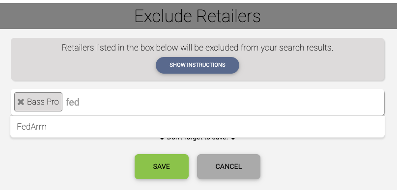

Imagine a world where you can become an individual activist, staging your very own personal boycott against a company with which you no longer wish to do business. [AmmoSeek](https://ammoseek.com/) can turn your imagination into realization with the exclude retailer(s) feature.

Let's say you have read many reviews about a retailer that are negative and you'd like boycott that retailer. Or perhaps you've had a poor buying experience from a particular retailer and you'd no longer like to do business with them. One of the features provided with a free AmmoSeek account is the ability to have your very own retailer exclusion list.

Any retailer you place on this list will prevent their products from appearing in your search results. Not only that, but the list also applies to [price alerts](/posts/howto-alerts) you have set. Essentially, adding a retailer to this list bans the retailer from AmmoSeek for you.

### How To Exclude Retailers

First, you'll need a a free AmmoSeek account. You can [register from the signin page](https://ammoseek.com/signin). Once you have completed activation of your account you will then have access to [your exclude retailers](https://ammoseek.com/exclude_retailers) page.

You can access your exclude retailers page underneath your user menu once you are signed in. The user menu is under the button/dropdown in the upper right corner of your browser window (or under the hamburger / three bars menu on mobile).  In both cases, the dropdown/button is labeled with the name you entered during registration of your account. Once in the menu, just select the menu option labeled "Exclude Retailers".

Once on the "Exclude Retailers" page you are presented with some instructions and an empty box. Clicking in the empty box will list retailers in a dropdown. You can then select as many retailers as you wish. Each will be added to the box indicating you wish to exclude their products from your searches and alerts.

You can also type in the box to filter to specific retailers. See the screenshot below for an example.

You can visit these settings later to remove or add new retailers to your exclusion list anytime you are signed in. You can also view your exclusions from your "Account Settings" page.

The retailer exclustion list is just another feature that AmmoSeek provides that puts the power in your hands to "vote with your dollars", allowing you to effectively boycott/ban retailer(s) from appearing in your search results.

Stay sane, safe, healthy, and shoot straight!
