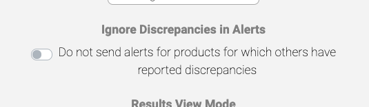

AmmoSeek has a new feature we'd like to let you know about: ignoring problem records in alerts. AmmoSeek lists over 200,000 products from over 100 retailers.

It is not feasible to verify all the data is accurate for each and every product we list. This is why every results record has a green flag icon sitting at the end of it. Clicking it reports that the corresponding record has some incorrect information within it. This notifies us of the discrepancy so corrective action can be taken, if needed.

Until now our price alerting system, see [AmmoSeek Price Alerts for Fun and Profit](/posts/howto-alerts), has included these potential problem records in the alerting mechanism (saved search). Today, we are introducing a new feature for registered users that allows you to ignore any specific records that have been reported as having problems by other users. We call these problems discrepancy reports.

To access this feature you first need to have a registered account and then be signed in to AmmoSeek. AmmoSeek accounts are free and can be initiated from our [login / join page](https://ammoseek.com/signin).

Under the user menu in the upper right corner of the browser window (on non-mobile) you can open your personal *Account Settings* window and the new option can be toggled on or off. For mobile it first requires that you click on the "three dots" (hamburger) menu in the upper right, then on your user menu.

The feature is off by default. Here's a screenshot:

Turning this feature on will no longer alert you if "problem" products match your alert threshold and will only alert on records that have not been reported to have problems (at the time of the alert notification).

Thank you. Stay safe. Stay free, and always shoot straight!
