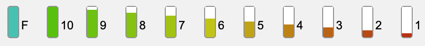
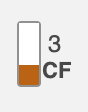
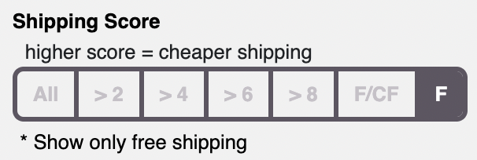
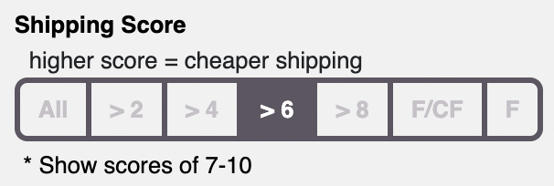
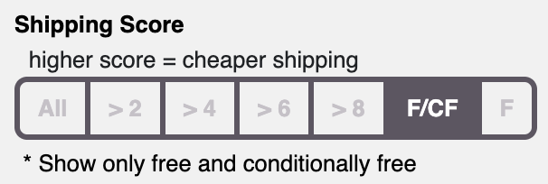

AmmoSeek has had a major change in the way our shipping ratings works. Here are the details.

### The Why?
The original shipping rating algorithm was inadequate, mainly because of the subjective ratings of *Highest*, *High*, *Average*, *Low*, *Lowest*, etc.. One man's "Average" is another man's "Highest".

Also, the individual ratings themselves were too few. This means there were a wide range of shipping costs present in each ratings bucket.

In an attempt to overcome these shortcomings, we have introduced an entirely new shipping "score" system.

### The New System
The new scores look like the following (click the image to see a larger view):

The **F** "score" represents free shipping. The other scores go from 10 down to 1 with 10 (green) representing the lowest cost shipping and 1 (red) representing the highest. In addition, if the product ships free under certain conditions, it will be represented with a CF next to the meter. For example:

### Disclaimer

Please remember that our system may not represent actual or precise shipping costs for certain orders to specific zip codes. The score is meant as a general guide to help folks determine (at a glance) if a retailer may have cheaper or more expensive shipping costs.

### New Feature: Show Free Shipping Only

With this update, we've also implemented a long-requested feature: showing only free shipping in search results. For ammunition searches there is a new way to specify the shipping scores you want to show in your search results. Here are some examples:

### Confusion and Conclusion

There is some concern that the new system could cause some confusion: a higher score means cheaper shipping. In our previous system a higher number of bars in the meter image meant higher shipping. The old system had no color coded graphic, but the new system does.

**BOTTOM LINE:** For results without free shipping:
- The **MORE GREEN** (HIGHER SCORE) the bar in the meter, the cheaper the shipping.
- The **MORE RED** (LOWER SCORE) the bar in the meter, the more expensive the shipping.

There is quite a bit of new code in this update. If you notice any bugs or have any questions about the new system please [let us know](https://ammoseek.com/contact).

Enjoy!
