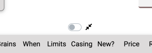
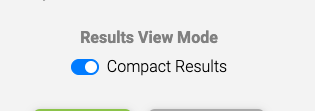

There's a brand new feature up and running on the [AmmoSeek beta](https://beta.ammoseek.com/?utm_source=blog.ammoseek.com&utm_medium=compact_article) site right now that we think some will really like.

A few comments we received about the beta site is that the results are too spread out and sparse, much unlike the classic AmmoSeek site. We took this to heart and have implemented a new 'compact' view mode for the results. This compact view works on both mobile and desktop devices. Read on for further details.

Designing a web site these days a lot must be taken into consideration. One huge thing is Search Engine Optimization (SEO). Computers tend to read web pages very differently than humans even though SEO experts say that search engine crawlers do their best to figure out how useful a site is. One are that has happened in the past few years is the move to crawling sites as a mobile device.

Google (and others) indexes pages with a mobile-first philosophy and penalizes sites that have buttons/links close together, small text, etc. It considers these legacy sites non-mobile and less user-friendly. But what about those of us that like this kind of design and try to avoid scrolling as much as possible?

The default viewing mode for the [AmmoSeek Beta](https://beta.ammoseek.com/?utm_source=blog.ammoseek.com&utm_medium=compact_article) is geared towards the design philosophy of using whitespace to make it useful and look good. That means, we use padding, tabs, margins, and whitespace copiously. The tradeoff of this is extra scrolling/swiping/clicking on mobile (smaller) devices. Indeed, on mobile, the beta site sometimes only shows 2 results without having to scroll.

After receiving a few messages that there was a preference for a similar 'compact' results table, we decided to implement a way to toggle into and out of this mode. We also added it as a user option so it can be set permanently for logged in users.

To toggle this mode, there's a switch above the results table. On desktop devices it is located a bit to the left of the 'SHARE' link. On mobile it appears above the results on the left edge of the screen. It looks like this:

To save this as your own default results view mode:

-  Log in (if you don't already have an account you can easily sign up for one for free)
-  Select the user menu dropdown (button that displays your user name)
-  Select the "Account Settings" option to bring up your account settings
-  Towards the bottom of the window there is a toggle switch to turn it on (or off):

-  Then don't forget to his the SAVE button to store your choice.

**Please note** that this mode is not for folks with bad eyesight as the results are compressed greatly and a smaller font is used. In the end we aim to give folks the ability to customize the new AmmoSeek look and feel to their desires.

We thank you for using AmmoSeek and we hope you find the new compact view mode feature useful.

[Try the new AmmoSeek](https://beta.ammoseek.com/?utm_source=blog.ammoseek.com&utm_medium=compact_article)

Please [let us know](https://beta.ammoseek.com/contact) if you notice any problems with the beta site. We are trying to squash as many bugs as possible before we replace the classic site with it!
