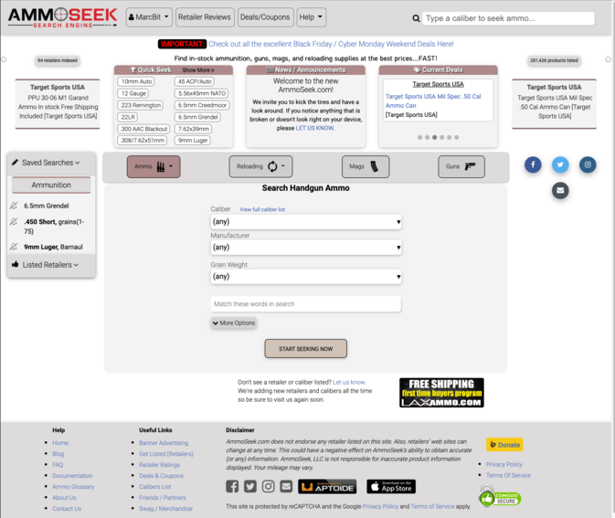
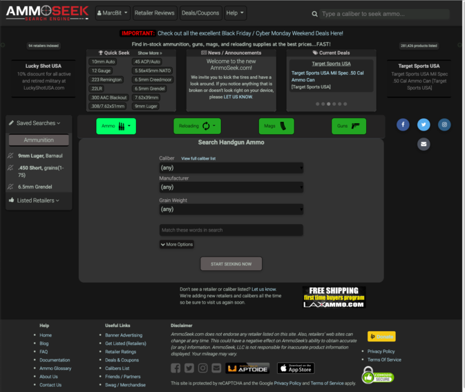
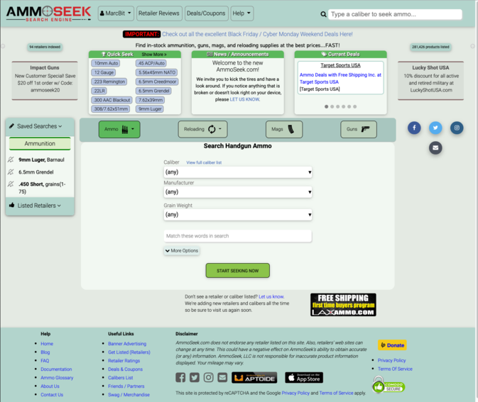
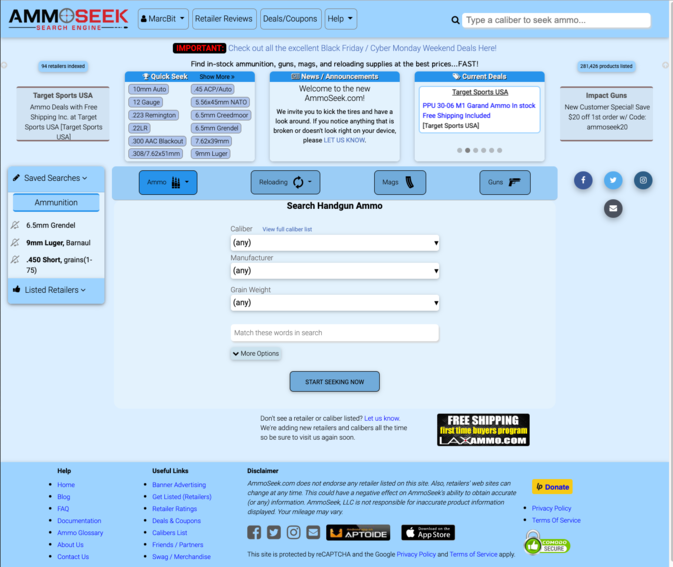
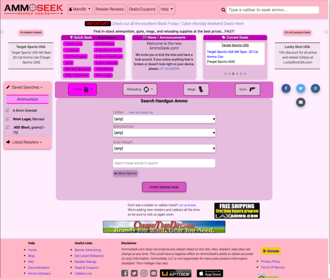

It appears from our recent beta survey that there are many people who aren't aware of one of the new AmmoSeek's best features: color themes. So with that it is time to let you know that AmmoSeek, well...

```
She comes in colors ev'rywhere
She combs her hair
She's like a rainbow
             - The Rolling Stones
```

`youtube: https://youtu.be/6c1BThu95d8`

Yes, AmmoSeek now comes in colors. In order to save/remember your color preferences this feature does require a free registered AmmoSeek account. Once you have an account ([get one here](https://beta.ammoseek.com/signin?utm_source=blog.ammoseek.com&utm_medium=ammoseek-feature-color-themes)) **go to the "Account Settings" option under the user menu to find and set your preferred color theme**.

Also, don't forget to [check out "Compact Results Mode"](/posts/ammoseek-feature-compact-results) for a much less sparse/spaced-out results page.

Currently, we are offering 5 different themes and plan to add more in the future based upon user feedback. Here are some screenshots of each.

The default "Gray Ogre" theme:


The dark mode theme "Dark Demon":


The green theme "Gone Green":


The blue theme "Blue Bayou":


and lastly, just for fun, the pink theme "Pink Pussycat":


Feel free to [reach out to us](https://beta.ammoseek.com/contact?utm_source=blog.ammoseek.com&utm_medium=ammoseek-feature-color-themes) and request other color palettes and we'll pick the more popular ones and create color schemes for them.

Or find ammo, guns, magazines, and reloading components in style by picking your favorite from the above and set it in your user settings for future visits!
